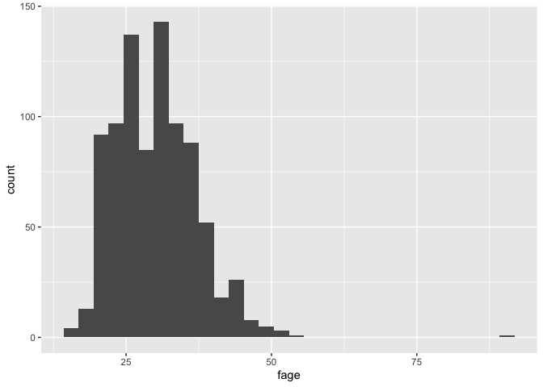
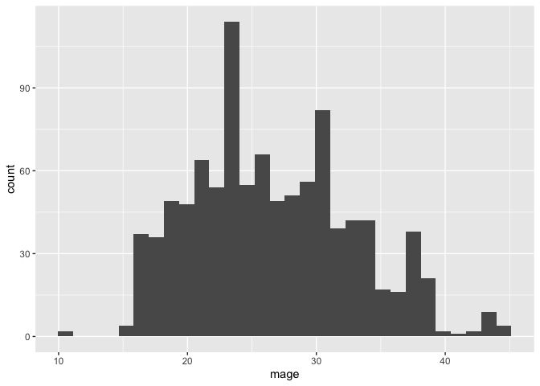
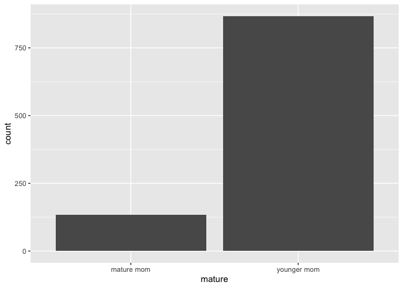
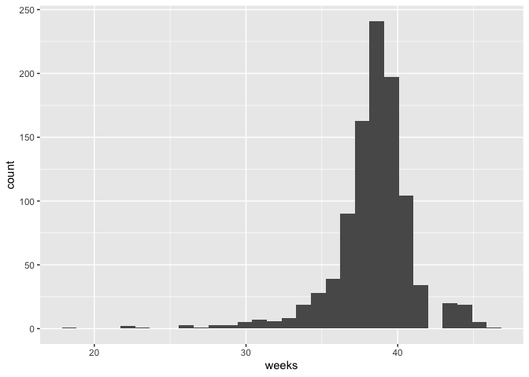
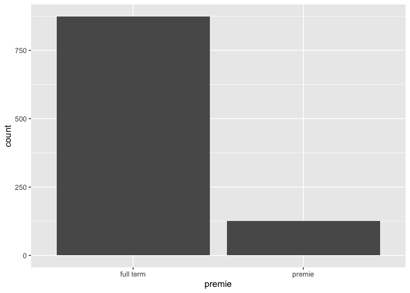
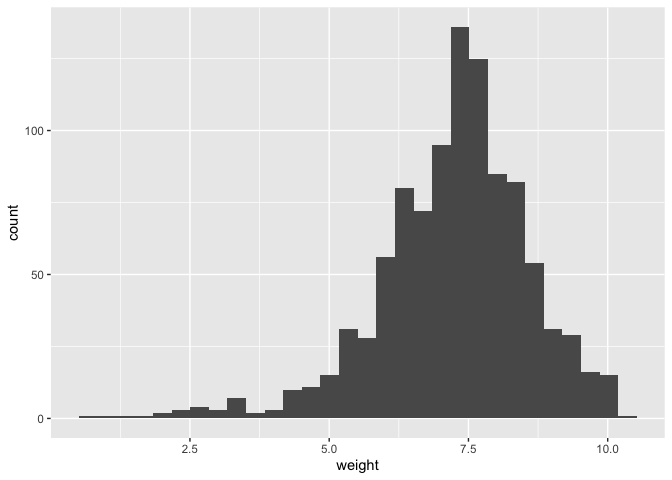
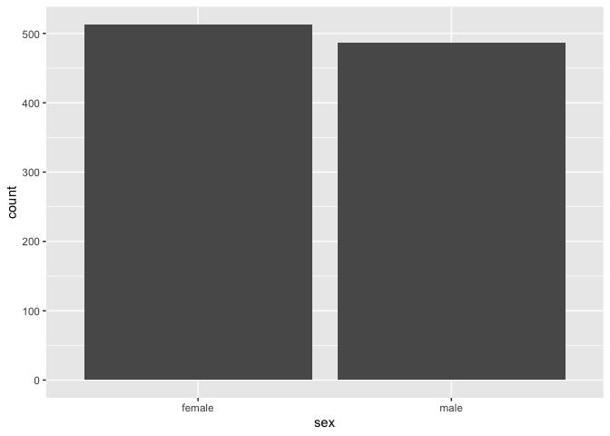

NC births
================
Amelia McNamara

An attempt to reproduce the `ncbirths` dataset from the `openintro`
package. Data provenance has been lost on that dataset, other than the
fact that it’s from 2004.

I found the [ICPSR data
from 2004](https://www.icpsr.umich.edu/web/ICPSR/studies/4707/versions/V1),
which is quite large.

``` r
X04707_0001_Data <- read_delim("ICPSR_04707/DS0001/04707-0001-Data.tsv",
  "\t", escape_double = FALSE, trim_ws = TRUE)
nrow(X04707_0001_Data)
```

Not going to run that code when I knit because it’s so big. `nrow`
should be 4118907.

## North Carolina

Then, I filtered down to just the babies from North Carolina.

``` r
nc <- filter(X04707_0001_Data, OSTATE == "NC")
nrow(nc)
```

For the record, `nrow` there should be 120588.

Let’s write out just those babies for the future,

``` r
write_csv(nc, "nc_full.csv")
```

And, for our purposes in the document, we can start there,

``` r
nc <- read_csv("nc_full.csv")
```

    ## Parsed with column specification:
    ## cols(
    ##   .default = col_double(),
    ##   REVISION = col_character(),
    ##   OSTATE = col_character(),
    ##   MAGE_IMPFLG = col_logical(),
    ##   MAGE_REPFLG = col_logical(),
    ##   UMBSTATE = col_character(),
    ##   XMRSTATE = col_character(),
    ##   MRSTATE = col_character(),
    ##   MBRACE = col_logical(),
    ##   MAR_IMP = col_logical(),
    ##   MEDUC = col_logical(),
    ##   FAGERPT_FLG = col_logical(),
    ##   FBRACE = col_logical(),
    ##   PRECARE = col_logical(),
    ##   PRECARE_REC = col_logical(),
    ##   APNCU = col_logical(),
    ##   DFPC_IMP = col_logical(),
    ##   CIG_0 = col_logical(),
    ##   CIG_1 = col_logical(),
    ##   CIG_2 = col_logical(),
    ##   CIG_3 = col_logical()
    ##   # ... with 4 more columns
    ## )

    ## See spec(...) for full column specifications.

    ## Warning: 5 parsing failures.
    ##    row      col expected actual          file
    ##   1161 METRORES a double      Z 'nc_full.csv'
    ##  53843 METRORES a double      Z 'nc_full.csv'
    ##  81265 METRORES a double      Z 'nc_full.csv'
    ##  84753 METRORES a double      Z 'nc_full.csv'
    ## 119489 METRORES a double      Z 'nc_full.csv'

## Cleaning

Using the data dictionary, I renamed the variables that looked relevant,
and selected those out.

``` r
nc <- nc %>%
  rename(
    fage = FAGEREC11,
    mage = MAGER14,
    weeks = COMBGEST,
    visits = UPREVIS,
    gained = WTGAIN,
    weight_g = DBWT,
    sex = SEX,
    habit = CIG_REC6,
    marital = MAR,
    whitemom = MRACEREC
  ) %>%
  select(fage, mage, weeks, visits, 
         gained, weight_g, sex, habit, marital, whitemom)
```

Again using the data dictionary, I recoded most of the variables.

``` r
nc <- nc %>%
  mutate(
    fage = case_when(
      fage == 1 ~ "Under 15 years",
      fage == 2 ~ "15-19 years",
      fage == 3 ~ "20-24 years",
      fage == 4 ~ "25-29 years",
      fage == 5 ~ "30-34 years",
      fage == 6 ~ "35-39 years",
      fage == 7 ~ "40-44 years",
      fage == 8 ~ "45-49 years",
      fage == 9 ~ "50-54 years",
      fage == 10 ~ "55-98 years",
      fage == 11 ~ "Not stated"
    ),
    mage = case_when(
      mage == 1 ~ "Under 15 years",
      mage == 3 ~ "15 years",
      mage == 4 ~ "16 years",
      mage == 5 ~ "17 years",
      mage == 6 ~ "18 years",
      mage == 7 ~ "19 years",
      mage == 8 ~ "20-24 years",
      mage == 9 ~ "25-29 years",
      mage == 10 ~ "30-34 years",
      mage == 11 ~ "35-39 years",
      mage == 12 ~ "40-44 years",
      mage == 13 ~ "45-49 years",
      mage == 14 ~ "50-54 years"
    ),
    mature = case_when(
      mage %in% c("35-39 years", "40-44 years", "45-49 years", "50-54 years") ~ "mature mom",
      TRUE ~ "younger mom"
    ),
    weeks = case_when(
      weeks == 99 ~ NA_real_,
      TRUE ~ weeks
    ),
    # could read 99 in as NA in read_delim?
    premie = case_when(
      weeks < 37 ~ "premie",
      weeks >= 37 ~ "full term",
      is.na(weeks) ~ NA_character_
    ),
    visits = case_when(
      visits == 99 ~ NA_real_,
      TRUE ~ visits
    ),
    gained = case_when(
      gained == 99 ~ NA_real_,
      TRUE ~ gained
    ),
    weight = weight_g / 453.59237,
    lowbirthweight = case_when(
      weight <= 5.5 ~ "low",
      TRUE ~ "not low"
    ),
    sex = case_when(
      sex == 1 ~ "male",
      sex == 2 ~ "female"
    ),
    habit = case_when(
      habit == 0 ~ "nonsmoker",
      habit == 6 ~ NA_character_,
      TRUE ~ "smoker"
    ),
    marital = case_when(
      marital == 1 ~ "married",
      marital == 2 ~ "not married",
      marital == 9 ~ NA_character_
    ),
    whitemom = case_when(
      whitemom == 1 ~ "white",
      TRUE ~ "not white"
    )
  )
nc <- nc %>%
  select(fage, mage, mature, weeks, premie, visits, 
         gained, weight, lowbirthweight, sex, habit, 
         marital, whitemom)
dim(nc)
```

    ## [1] 120588     13

## Random sample

Because `ncbirths` is only 1,000 rows, I took a random sample.

``` r
set.seed(42)
nc_sample <- nc %>%
  sample_n(1000)
data(ncbirths)
```

## Comparing to ncbirths

Then, I did all the univariate plots to compare my sample to `ncbirths`.
There were some differences right off the bat:

Father’s age is now categorical

``` r
ggplot(ncbirths) +
  geom_histogram(aes(fage))
```

    ## `stat_bin()` using `bins = 30`. Pick better value with `binwidth`.

    ## Warning: Removed 171 rows containing non-finite values (stat_bin).

``` r
ggplot(nc_sample) +
  geom_bar(aes(fage))
```


As is mother’s age

``` r
ggplot(ncbirths) +
  geom_histogram(aes(mage))
```

    ## `stat_bin()` using `bins = 30`. Pick better value with `binwidth`.

``` r
ggplot(nc_sample) +
  geom_bar(aes(mage))
```


I think we could probably do some sort of recoding along the lines of,

``` r
# this doesn't work at all
test <- nc_sample %>%
  select(mage)
test <- test %>%
  mutate(mage2 = case_when(
    mage == "15-19 years" ~ sample(15:19, size = 1),
    TRUE ~ mage
  ))
```

But I’d have to think about it more. It would probably make sense to do
it before we take the random sample.

Beyond that, the distributions are pretty comparable

``` r
ggplot(ncbirths) +
  geom_bar(aes(x = mature))
ggplot(nc_sample) +
  geom_bar(aes(x = mature))
```



``` r
ggplot(ncbirths) +
  geom_histogram(aes(weeks))
```

    ## `stat_bin()` using `bins = 30`. Pick better value with `binwidth`.

    ## Warning: Removed 2 rows containing non-finite values (stat_bin).

``` r
ggplot(nc_sample) +
  geom_histogram(aes(weeks))
```

    ## `stat_bin()` using `bins = 30`. Pick better value with `binwidth`.



We randomly didn’t sample any NAs here, so that’s a little different

``` r
ggplot(ncbirths) +
  geom_bar(aes(x = premie))
ggplot(nc_sample) +
  geom_bar(aes(x = premie))
```



``` r
ggplot(ncbirths) +
  geom_histogram(aes(visits))
```

    ## `stat_bin()` using `bins = 30`. Pick better value with `binwidth`.

    ## Warning: Removed 9 rows containing non-finite values (stat_bin).

``` r
ggplot(nc_sample) +
  geom_histogram(aes(visits))
```

    ## `stat_bin()` using `bins = 30`. Pick better value with `binwidth`.

    ## Warning: Removed 9 rows containing non-finite values (stat_bin).



``` r
ggplot(ncbirths) +
  geom_histogram(aes(gained))
```

    ## `stat_bin()` using `bins = 30`. Pick better value with `binwidth`.

    ## Warning: Removed 27 rows containing non-finite values (stat_bin).

``` r
ggplot(nc_sample) +
  geom_histogram(aes(gained))
```

    ## `stat_bin()` using `bins = 30`. Pick better value with `binwidth`.

    ## Warning: Removed 24 rows containing non-finite values (stat_bin).



``` r
ggplot(ncbirths) +
  geom_histogram(aes(weight))
```

    ## `stat_bin()` using `bins = 30`. Pick better value with `binwidth`.

``` r
ggplot(nc_sample) +
  geom_histogram(aes(weight))
```

    ## `stat_bin()` using `bins = 30`. Pick better value with `binwidth`.


``` r
ggplot(ncbirths) +
  geom_bar(aes(x = lowbirthweight))
ggplot(nc_sample) +
  geom_bar(aes(x = lowbirthweight))
```


``` r
ggplot(ncbirths) +
  geom_bar(aes(x = gender))
ggplot(nc_sample) +
  geom_bar(aes(x = sex))
```



``` r
ggplot(ncbirths) +
  geom_bar(aes(x = habit))
ggplot(nc_sample) +
  geom_bar(aes(x = habit))
```


Again, we didn’t randomly sample NAs for marital status

``` r
ggplot(ncbirths) +
  geom_bar(aes(x = marital))
ggplot(nc_sample) +
  geom_bar(aes(x = marital))
```



or race

``` r
ggplot(ncbirths) +
  geom_bar(aes(x = whitemom))
ggplot(nc_sample) +
  geom_bar(aes(x = whitemom))
```


## Other checks

Following [Mine’s
lab](http://www2.stat.duke.edu/~mc301/ARTSCI101_Su16/post/r/nc_births.html)
I wanted to make sure things look similar enough there.

``` r
ncbirths %>%
  summarise(mean_wt = mean(weight), sd_wt = sd(weight), n = n())
```

    ## # A tibble: 1 x 3
    ##   mean_wt sd_wt     n
    ##     <dbl> <dbl> <int>
    ## 1    7.10  1.51  1000

``` r
nc_sample %>%
  summarise(mean_wt = mean(weight), sd_wt = sd(weight), n = n())
```

    ## # A tibble: 1 x 3
    ##   mean_wt sd_wt     n
    ##     <dbl> <dbl> <int>
    ## 1    7.19  1.38  1000

Those look close to me\!

## Bivariate relationships

``` r
ggplot(data = ncbirths, aes(x = habit, y = weight)) +
  geom_boxplot()
ggplot(data = nc_sample, aes(x = habit, y = weight)) +
  geom_boxplot()
```


``` r
ncbirths %>%
  group_by(habit) %>%
  summarise(mean_weight = mean(weight))
```

    ## `summarise()` ungrouping output (override with `.groups` argument)

    ## # A tibble: 3 x 2
    ##   habit     mean_weight
    ##   <fct>           <dbl>
    ## 1 nonsmoker        7.14
    ## 2 smoker           6.83
    ## 3 <NA>             3.63

``` r
nc_sample %>%
  group_by(habit) %>%
  summarise(mean_weight = mean(weight))
```

    ## `summarise()` ungrouping output (override with `.groups` argument)

    ## # A tibble: 3 x 2
    ##   habit     mean_weight
    ##   <chr>           <dbl>
    ## 1 nonsmoker        7.26
    ## 2 smoker           6.72
    ## 3 <NA>             8.62

Again, looks close.

## Writing data

Let’s write out that small dataset,

``` r
write_csv(nc_sample, "nc_sample.csv")
```
